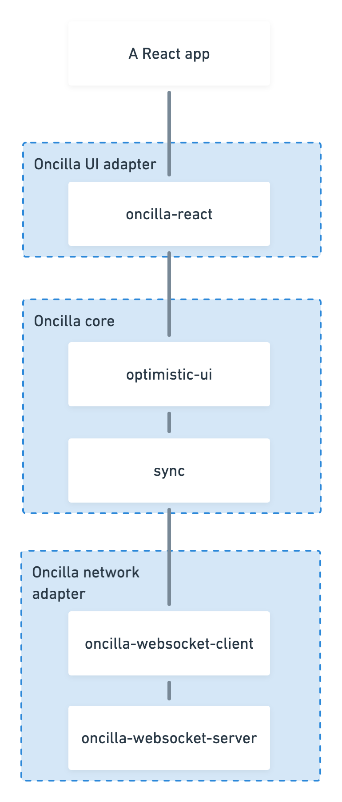

Feel free to create issues for defects and inquiries. For code contributions, please reach out first to align our design visions and avoid wasting any effort.

Internal contributors, please see [our board](https://trello.com/b/3Gz6QFfo/oncilla) for tracking the work on the project.

The component diagram on the left gives an overview what parts there are to Oncilla and allows to work on one part without being overwhelmed by everything else.

At the top there is the user’s application. A React app is the primary supported case today. On the bottom there is the user’s server. Data updates move from bottom to top, and the data modification requests move from top to bottom.

Next level is the Oncilla UI adapter layer. All code specific to a particular UI library belongs here. For oncilla-react, this is code that supports the React hooks that re-rendering a user’s component when new data is available and provide updater functions.

The lever below that is Oncilla core. All code that is the core value benefit of Oncilla belongs here. Because the world around Oncilla core is so malleable, we want to pull as much of our concern into the core as possible.

At the bottom there is the network layer. The current implementation is a custom protocol over WebSockets, but one could see an implementation for CouchDB being made, or a custom implementation for a custom REST API.
