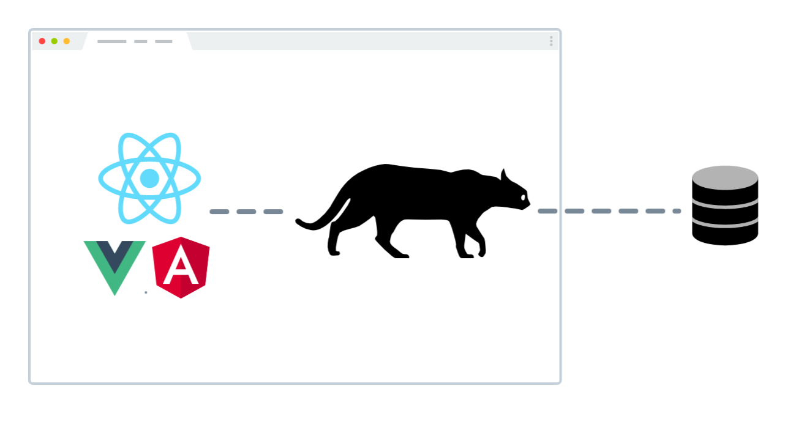

# 

Client-side database for easy to implement real-time and optimistic UI.

[](https://github.com/facebook/react/blob/master/LICENSE) [](https://www.npmjs.com/package/oncilla)  

Oncilla DB sits between your UI logic (i.e. React components) and your server and synchronizes the data between the two. It rerenders your views when new data arrives, and sends updates to the server in the background, allowing your UI to stay responsive. No matter what happens, whether errors or network connectivity issues arise, Oncilla will work to keep the data between your UI and the server in sync.



**Great developer experience.** Oncilla DB takes on complexity so that your code is as simple as possible. In React components, accessing and changing the data is synchronous and almost as easy as React’s useState. Features like prefetching, real-time updates, optimistic UI become trivial to enable.

**Great user experience.** Oncilla DB also takes on complexity so that you need not choose between your velocity and the user experience. Great user experience is the default.

**Wide flexibility.** You can use Oncilla DB with any view and persistence tooling you want. It comes at a cost of a bit more initial configuration, but that is something you setup once and forget. At the moment the primary supported tooling is React for the view and WebSockets for the server, and you still need to implement your database queries.

**Stable, but unpolished.** Oncilla DB is stable and used in production. That said, it’s a passion project limited by practicality, so many corners are as of yet unpolished, expect to contribute whenever you hit some corner cases or find missing advanced functionality.

## Usage

See [the setup guide](docs/README.md) for initial configuration.

Access and modify data with Oncilla with synchronous access.

```jsx
const [task, updateTask] = useData("tasks", taskId);
if (task === "loading") return <Spinner />;
return (
  <div>
    <input
      value={task.title}
      onChange={e => updateTask(prev => ({ ...prev, title: e.target.value }))}
    />
  </div>
);
```

A preview of how you access the information about the status of the synchronization, like whether the user is offline and whether any changes are not saved yet:

```jsx
const connectivity = useConnectivity();
return (
  <div>
    {connectivity === "offline" && <div>Offline. Changes will be saved when you go online.</div>}
    <MyView />
  </div>;
);
```

## Alternatives

Oncilla DB has been heavily inspired by PouchDB, CouchDB, and the Offline First thinking.

PouchDB brings a lot of battle-tested power to the table, but it relies on the CouchDB protocol for replication. Oncilla allows you to define your own replication protocol that will fit your API, or use a small Oncilla WebSocket protocol that is easy to implement in whichever backend.

Oncilla is in essence GraphQL live queries with no or very limited data dependencies, and a client-side oriented source of truth. For a more powerful approach with GraphQL live queries, see [the discussion on the spec](https://github.com/graphql/graphql-spec/issues/386) and a [good introductory video](https://www.youtube.com/watch?v=BSw05rJaCpA).

Other projects of interest: [Falcor](https://netflix.github.io/falcor/), upcoming Apollo Client 3.

## About Theorem


This software is lovingly maintained and funded by Theorem.
From whiteboarding new concepts to long-term support, Theorem works with startups and large multi-national enterprises to develop new applications, software, services, and platforms to achieve the best results and deliver Full Stack Innovation™

At Theorem we believe in and support open-source software.

- Check out more of our open-source software at Theorem.
- Learn more about [our work](https://theorem.co/portfolio).
- [Hire us](https://theorem.co/contact) to work on your project.
- [Want to join the team?](https://theorem.co/careers)

_Theorem and the Theorem logo are trademarks or registered trademarks of Theorem, LLC._

---

_The oncilla is a small tiger cat on the IUCN Red List._


