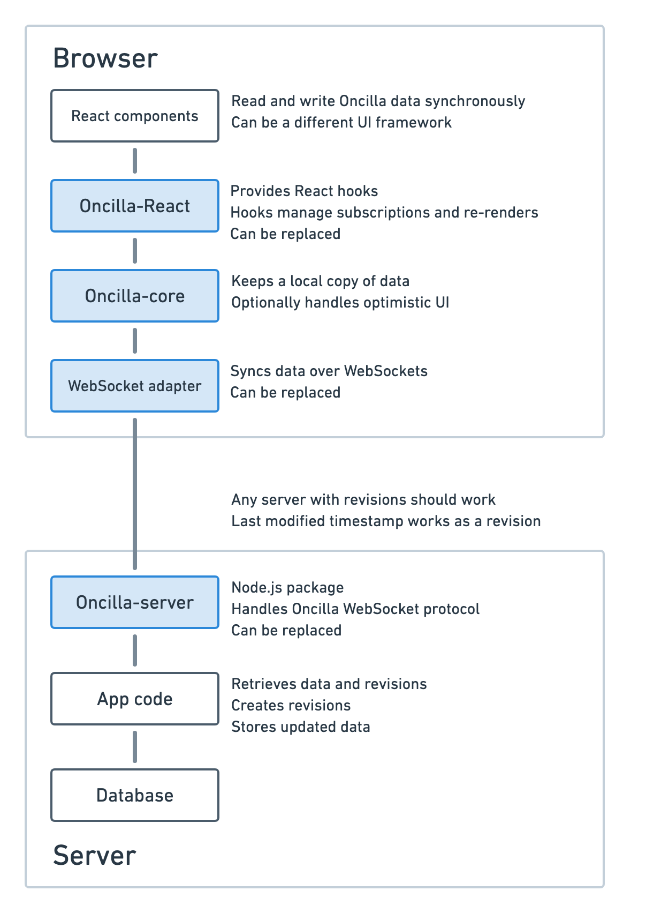

# Starting guide

Oncilla DB is flexible to avoid locking you down in any technology or architecture choices as much as possible. The downside of this is a more involved configuration process.

Install Oncilla DB from npm registry with `npm install --save oncilla`.

Your application data needs to be modeled in terms of kinds. Everything must have a kind and an entity of a particular kind and id will always be synchronized and edited atomically, in full. Everything also has an id, which with Oncilla we generate on the client. For an example, for a to-do app the kinds would be tasks and tags and for ids we can use uuids.

Configure Oncilla DB for your data kinds as described below. You also need to provide your instance of React for Oncilla to generate hooks specific to your application.

```js
import { configure } from "oncilla/dist/react";
const {
  create,
  useConnectivity,
  useCreate,
  useData,
  useMultipleData,
  useOncillaDebug,
  usePendingChanges,
} = configure({
  data: {
    categories: {},
    tasks: {},
  },
  React,
});
```

If you use TypeScript, add a TypeScript type to help the compiler catch typing errors. (The values of the generic parameter object are singular, confusingly)

```ts
configure<{ categories: Category; tasks: Task }>({
  data: { categories: {}, tasks: {} },
});
```

Then create an adapter that will save your data. To begin with, you can start with a dummy one that does not actually talk to a real server. In the code below a1 and a2 are ids of the items that will help the server know which items to update. The “singleton” is a special id for when there is always only one particular instance of a kind.

```js
import { makeDummyAdapter } from "oncilla";
const network = makeDummyAdapter({
  categories: { singleton: ["home", "studies", "fun"] },
  tasks: {
    a1: { title: "Buy milk", category: "home" },
    a2: { title: "Learn next chapter", category: "studies" },
  },
});
```

Now include your database in the UI. React is the primary way to use Oncilla, but you can also integrate with another view system.

```jsx
const { withDB } = create({ network: network });
ReactDOM.render(withDB(<App />));
```

Now you can use the data access hooks in your components, as shown in the [main readme](../README.md).

When you decide to move forward with the real network implementation, see [the networking docs](network/README.md).

 Oncilla-React -> Oncilla-core -> WebSocket adapter -> Oncilla-server -> App code -> Database" width="625">
